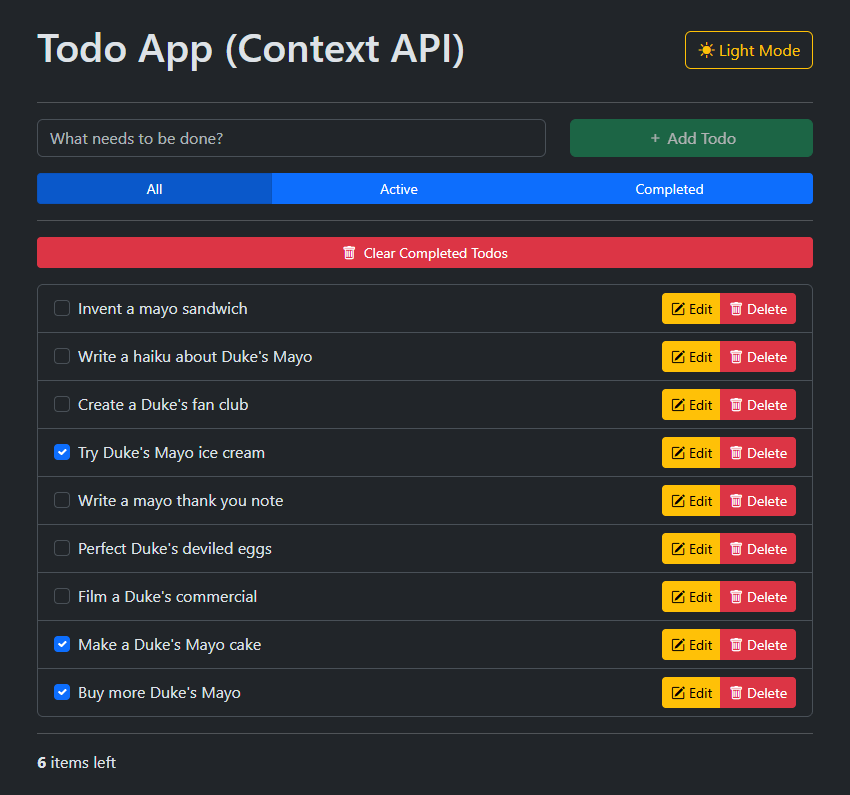

# Lab 10.3: Context API Implementation

[Karl Johnson](https://github.com/hirekarl)  
2025-RTT-30  
<time datetime="2025-08-06">2025-08-06</time>  



## Overview
### Viewer Instructions
1. Run the following in the terminal:

```bash
cd context-api-implementation && npm i && npm run dev
```

2. Navigate to http://localhost:5173 in the browser.

### Submission Source
Top-level application behavior can be found in [`./context-api-implementation/src/App.tsx`](./context-api-implementation/src/App.tsx).

### Reflection
During our activity time on Wednesday, Hassan suggested implementing a ContextProvider design pattern that wraps each Context's Provider in a functional component that encapsulates the logic of each Context. I found this really cleaned up my `App.tsx`. I'm still wrapping my head around use cases for `useCallback` and `useMemo`&mdash;if I have time after class today to dig deeper, I will work on implementing memoization throughout the app.

## Assignment
You are tasked with building a functional Todo application. Instead of relying on prop drilling or a complex third-party state management library for this scale, you will leverage React’s Context API to manage various aspects of the application’s state. This includes managing the list of todos, current visibility filters, and a simple theme.

This lab will provide practical experience in designing multiple contexts, implementing providers, consuming context values in components, and handling more involved state updates. You will also explore basic persistence and optimization considerations with Context.
